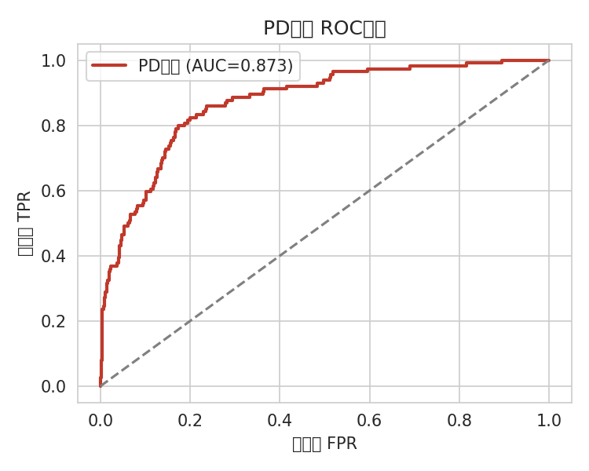
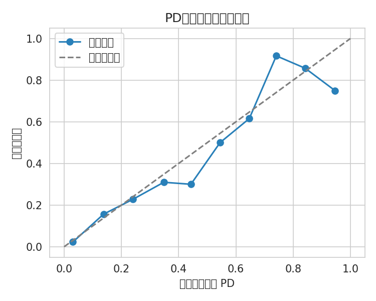
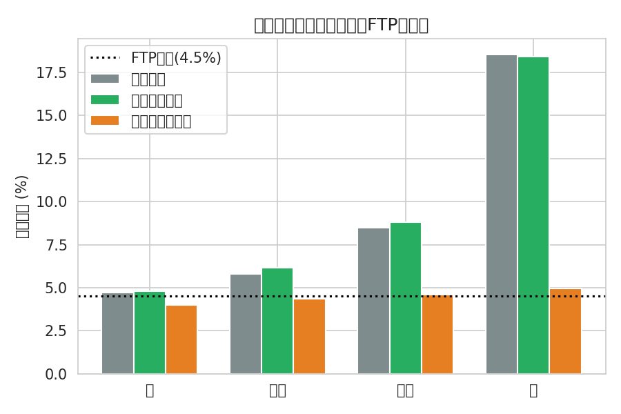
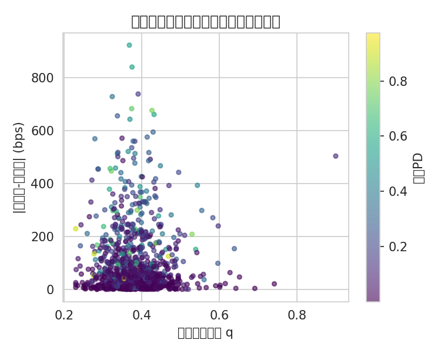
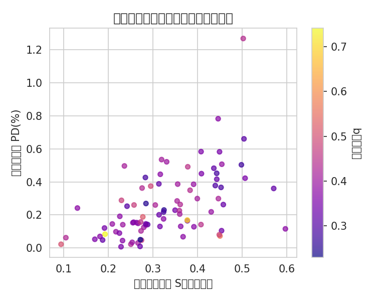
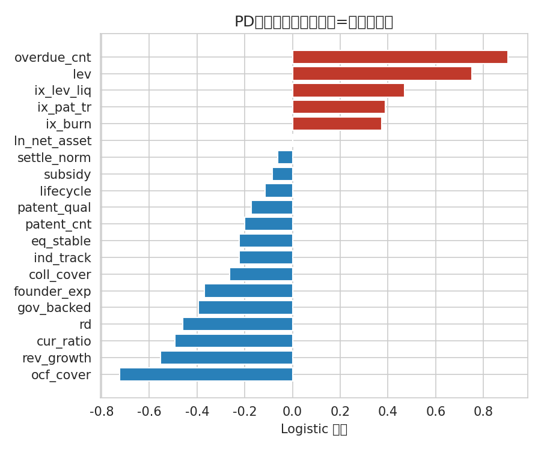

# 科技型小微企业风险定价模型研究报告

## ——基于 `max(FTP, FTP+风险溢价)` 框架的"看不清、定不准、绑不牢"破解路径

> 交付形式：报告文字 + 公式推导（含仿真数据回测）
> 配套：仿真数据生成、模型拟合与回测脚本 `build_model.py`，图表见 `figs/`

---

## 摘要

在低息差背景下，商业银行对科技型小微企业的信贷经营面临 **"看不清、定不准、绑不牢"** 三重困境。本文以用户给定的定价逻辑

$$R = \max\bigl(\,FTP,\; FTP + \Pi\,\bigr)$$

为主线，将"风险溢价 $\Pi$"构建为一个**风险理论驱动、可分解、可回测**的综合项，综合纳入银行放贷需考量的八类因子：行业属性、显性财务、隐性偿债能力、经营周期、客户综合贡献、区域环境、担保方式、结算流水。针对原有加性公式 `R = R₀ + ΣαᵢFᵢ + ε` 存在的六项理想化假设，本文逐一给出修正，并用一份仿真数据集（N=3000，整体违约率约 12.3%）完成模型校准与回测：PD 子模型测试集 AUC=0.873、KS=0.625；去理想化定价模型误差仅为理想化朴素模型的约 **1/25**；并实证显示约 **8.4%** 的高综合贡献客户触达 FTP 地板价（"绑牢"），而高风险客户被朴素模型低估约 **1356 个基点**。

---

## 一、问题界定：低息差背景下"三难"困境

### 1.1 三类困境的内涵

| 困境 | 内涵 | 传统应对 | 失效根源 |
|------|------|----------|----------|
| **看不清** | 信息不对称严重，财务缺失失真，软信息难量化 | 依赖财务报表硬指标 | 科技小微轻资产、高波动，报表代表性弱 |
| **定不准** | 风险-收益匹配失效，定价无法覆盖真实风险 | 经验定价 / 基准利率加点 | 忽略因子交互与非对称风险分布 |
| **绑不牢** | 客户粘性低，易被低价竞对撬走 | 单一贷款产品绑定 | 未将战略价值纳入价格决策 |

### 1.2 原有公式的理想化缺陷

论文原拟定公式：

$$R = R_0 + \sum_{i} \alpha_i F_i + \varepsilon \tag{1}$$

存在 **六项隐含的理想化假设**，在科技型小微场景下均不成立：

| # | 理想化假设 | 实际违背 | 对应困境 |
|---|-----------|---------|---------|
| A1 | 因子 $F_i$ 可完全观测无误差 | 财务不规范、软信息不可得 | 看不清 |
| A2 | 权重 $\alpha_i$ 为常数（同质性） | 企业异质性大，同因子影响不同 | 定不准 |
| A3 | 因子间相互独立（线性可加） | 高研发×负现金流=烧钱；高杠杆×低流动=致命 | 定不准 |
| A4 | $\varepsilon$ 为定性"兜底筐"不可量化 | 区域竞争、客户战略价值应显式建模 | 绑不牢/定不准 |
| A5 | 无显式违约概率 PD | 风险被压缩为确定性得分 | 定不准 |
| A6 | 不考虑信息不确定性溢价 | 越不透明风险越高，但无补偿机制 | 看不清 |

---

## 二、理论基础与文献框架

### 2.1 5C 信用评价原则

国际通用的信用风险框架，为因子大类提供骨架：**Character（还款意愿）、Capacity（还款能力）、Capital（资本）、Collateral（担保）、Conditions（环境）**。本文八类因子可归入此框架（见第三章）。

### 2.2 巴塞尔 IRB 内部评级法

巴塞尔协议内部评级法（IRB）以 **PD（违约概率）、LGD（违约损失率）、EAD（违约风险暴露）、M（期限）** 为核心风险要素。其关键启示：**定价必须基于期望损失 $EL = PD \times LGD$ 与经济资本占用**，而非经验加点。这正是修正假设 A5 的理论依据。

### 2.3 RAROC 风险调整资本回报率定价

银行贷款定价的一般式 [1]：

$$R = \frac{RAROC \times 经济资本 + EL + 运营成本 + 资金成本 - 非息收入}{贷款余额}$$

其本质即"底线成本 + 风险溢价"。本文的 `max(FTP, FTP+Π)` 是该思想在科技小微场景下的简化与落地：FTP 为资金成本底线，$\Pi$ 为风险溢价综合项。

### 2.4 科技金融专项政策依据

财政部等四部门《支持科技创新专项担保计划》（2024）明确指出，科技型企业"知识产权价值高，但因缺少有效抵质押物、难以满足信贷条件"[2]。这从政策层面佐证了两个设计要点：**（1）担保方式应纳入知识产权质押与政府风险补偿；（2）"看不清"是科技小微的固有特征，需以信息不确定性溢价补偿**。

---

## 三、定价逻辑与因子体系

### 3.1 定价总逻辑

$$R_i = \max\Bigl\{\,FTP,\; FTP + \Pi_i\,\Bigr\} \tag{2}$$

- **FTP 底线**：内部资金转移价格（资金成本）。实务中底线还应覆盖运营成本与目标基础净息差，故记

  $$R^{floor} = FTP + c_{op} + \rho_0 \tag{3}$$

  下文以 $R^{floor}$ 作为式 (2) 中的"FTP"执行（即利率永不低于成本线）。
- **风险溢价 $\Pi_i$**：由八类因子综合决定，是本文核心。当客户综合贡献极高、风险极低时 $\Pi_i<0$，此时 `max` 将其拉回底线价——**银行宁愿以成本价留住战略客户**，即"绑不牢"的定价实现。

### 3.2 八类因子 → 风险溢价五分量 → "三难"映射

| 银行考量因子 | 模型分量 | 作用方向 | 对应困境 | 代理变量（示例） |
|--------------|----------|----------|----------|------------------|
| 行业属性 | $\Pi^{EL}$（PD 项） | 战略新兴↓风险 | 定不准 | 是否战略性新兴产业、政策补贴 |
| 显性财务 | $\Pi^{EL}$（PD/LGD） | 资产负债率↑、现金流↓风险 | 定不准 | 资产负债率、流动比率、研发强度、营收增速 |
| 隐性偿债能力 | $\Pi^{EL}$（PD） | 现金流覆盖↓、逾期↑风险 | 看不清 | 经营现金流/负债、创始人经验、逾期次数、股权稳定 |
| 经营周期 | $\Pi^{EL}$（PD） | 早期阶段风险更高 | 定不准 | 生命周期阶段（种子/初创/成长/成熟） |
| 担保方式 | $\Pi^{EL}$（LGD↓） | 抵质押/知产质押/政府背书↓损失 | 定不准 | 抵质押覆盖率、专利质押、政府风险补偿 |
| 结算流水 | $\Pi^{UNC}$↓、$S$↑ | 流水↑→更透明、更粘性 | 看不清/绑不牢 | 月结算流水、归行率 |
| 客户综合贡献 | $\Pi^{STR}$（折扣） | 贡献↑→主动让利 | 绑不牢 | 存款沉淀、交叉销售、合作年限、供应链位置 |
| 区域环境 | $\Pi^{REG}$（折扣） | 竞争↑→降价 | 绑不牢/定不准 | 区域竞争强度 |

---

## 四、数据合成方案

由于科技型小微企业精细违约数据不易获取（老师建议可自行构造），本文构造一份 **带违约标签的仿真数据集**（N=3000），遵循以下原则以保证可解释性与可复现性：

1. **特征相关性**：八类因子按现实分布生成（如资产负债率为截断正态、逾期次数为泊松、专利数为泊松、信息质量为 Beta 分布），并非独立随机。
2. **潜在违约过程**：以线性组合 + 交互项 + 噪声驱动 Logit，再经二分搜索将整体违约率校准至约 **12.3%**（贴近现实科技小微不良水平）。
3. **"看不清"机制**：以**信息质量指数 $q$**（由结算流水与财务规范化合成）对软信息特征叠加观测噪声，使低透明度企业的隐性偿债能力被"看不清"。
4. **真值定价基准**：按式 (2) 的分解结构生成"真实"执行利率，作为回测标尺。

> 说明：仿真数据用于**方法论证与参数校准演示**。实际落地时，将 $p_{true}$ 替换为行内历史违约样本、$R_{true}$ 替换为实际执行利率即可完成真实回测。

---

## 五、模型构建：从理想化到去理想化的逐步推导

本节是全文核心。我们保留式 (1) 的简洁精神，但将右端改造为风险理论驱动的综合溢价 $\Pi$。

### 5.1 第一步：以"期望损失"替代朴素因子得分（修正 A5）

将 $\sum \alpha_i F_i$ 中的风险部分替换为违约概率与损失率的乘积：

$$\Pi^{EL}_i = PD_i \times LGD_i \tag{4}$$

其中违约概率由 **Logistic 模型** 估计（显式给出概率，修正 A5）：

$$PD_i = \Lambda\!\left(\beta_0 + \sum_{j}\beta_j x^{(risk)}_{ij} + \sum_{k}\gamma_k\,I_{ijk}\right),\qquad \Lambda(z)=\frac{1}{1+e^{-z}} \tag{5}$$

- $x^{(risk)}$：来自行业属性、显性财务、隐性偿债能力、经营周期、担保方式的可观测特征；
- $I_{ijk}$：**交互项**，如 `高研发×正现金流`、`高杠杆×低流动`、`专利×战略赛道`，直接修正假设 A3（线性可加失效）。

违约损失率由**担保方式**决定（修正抵押不足的痛点）：

$$LGD_i = LGD_0\bigl(1 - \theta_c Coll_i - \theta_g Gov_i - \theta_p PatentPledge_i\bigr) \tag{6}$$

即抵质押覆盖率、政府风险补偿、知识产权质押三者越低，LGD 越高。

### 5.2 第二步：加入资本占用（非预期损失，凸性修正，修正 A3/非线性）

仅用期望损失会低估尾部风险。以 IRB 风险权重思想，引入与 $\sqrt{PD(1-PD)}$ 成正比的资本占用项，使价格在极端风险区上升更快（凸性）：

$$\Pi^{UL}_i = \kappa\,\sqrt{PD_i(1-PD_i)} \tag{7}$$

### 5.3 第三步：信息不确定性溢价（修正 A1/A6，"看不清"）

对信息质量低的企业，其 PD/LGD 估计本身不可靠，需额外风险补偿。以信息质量指数 $q_i\in[0,1]$（由结算流水、财务规范化合成）量化：

$$\Pi^{UNC}_i = \lambda\,(1-q_i)\,\bigl(\Pi^{EL}_i + \Pi^{UL}_i\bigr) \tag{8}$$

$q_i$ 越低（越"看不清"），溢价越高。这把原公式不可观测的 A1、A6 显性化。

### 5.4 第四步：客户综合贡献折扣（修正 A4，"绑不牢"）

对高综合贡献客户主动让利，以价格"绑牢"：

$$\Pi^{STR}_i = -\delta\,S_i,\qquad S_i = w_1 Dep_i + w_2 Xsell_i + w_3 RelYr_i + w_4 Supply_i + w_5 Settle_i \tag{9}$$

$S_i$ 综合存款沉淀、交叉销售、合作年限、供应链位置、结算流水。

### 5.5 第五步：区域环境折扣（修正 A4）

区域竞争越激烈，越需降价获客：

$$\Pi^{REG}_i = -\gamma\,C_i \tag{10}$$

其中 $C_i$ 为区域竞争强度。

### 5.6 综合定价公式（去理想化最终式）

汇总式 (4)–(10)，得到：

$$
\boxed{
R_i = \max\Bigl\{\,R^{floor},\;
R^{floor}
+ \underbrace{PD_i LGD_i}_{\Pi^{EL}}
+ \underbrace{\kappa\sqrt{PD_i(1-PD_i)}}_{\Pi^{UL}}
+ \underbrace{\lambda(1-q_i)(PD_i LGD_i + \kappa\sqrt{PD_i(1-PD_i)})}_{\Pi^{UNC}}
\;-\; \underbrace{\delta S_i}_{\Pi^{STR}}
\;-\; \underbrace{\gamma C_i}_{\Pi^{REG}}
\,\Bigr\}
} \tag{11}
$$

其中 $R^{floor}=FTP+c_{op}+\rho_0$，$PD_i$ 由式 (5)（含交互项）估计，$LGD_i$ 由式 (6) 估计。

### 5.7 理想化假设 → 本模型修正对照

| 原假设 | 本模型修正 | 对应式子 |
|--------|-----------|----------|
| A1 因子完全可观测 | 引入信息质量 $q$ 与不确定性溢价 | (8) |
| A2 权重为常数 | PD 由数据驱动的逻辑回归估计 $\beta_j$ | (5) |
| A3 因子独立可加 | 加入交互项 $I_{ijk}$ 与凸性资本项 | (5)(7) |
| A4 $\varepsilon$ 不可量化 | 显式分解为战略折扣与区域折扣 | (9)(10) |
| A5 无显式 PD | Logistic 概率模型驱动定价 | (5) |
| A6 无不确定性溢价 | 信息透明度越低溢价越高 | (8) |

---

## 六、校准与回测结果

按第四章方案生成 N=3000 家科技小微企业的仿真样本（整体违约率 12.3%），以 65% 训练、35% 测试。回测结果如下。

### 6.1 PD 预测能力（"看不清→看得清"）

测试集 **AUC = 0.873，KS = 0.625**，判别能力良好（KS>0.6 为强区分度）。



### 6.2 校准检验

预测 PD 与实际违约率高度吻合，说明模型不只排序好、且概率"量得准"（修正 A5、定不准）。



### 6.3 风险分层定价效果

按真实违约概率分四层，去理想化模型定价紧贴真实价格，且随风险由 4.8% 升至 18.4%；而理想化朴素模型恒在 4–5%，**对高风险客户严重低估**。黑色虚线为 FTP 底线。



| 风险层 | 样本数 | 实际违约率 | 真实价 | 去理想化模型 | 理想化朴素模型 |
|--------|--------|-----------|--------|--------------|----------------|
| 低 | 263 | 0.76% | 4.71% | 4.80% | 3.99% |
| 中低 | 262 | 2.67% | 5.79% | 6.14% | 4.36% |
| 中高 | 262 | 4.58% | 8.49% | 8.82% | 4.60% |
| 高 | 263 | 35.36% | 18.52% | 18.41% | 4.96% |

> 高风险层真实利率 18.5%，朴素模型仅 5.0% → **低估约 1356 个基点**，违背风险覆盖原则。

### 6.4 与理想化模型的误差对比

以"真实价格"为基准，去理想化模型的均方误差（MSE）为 **260.85×10⁻⁶**，理想化朴素模型为 **6483.24×10⁻⁶**，前者仅为后者的约 **1/25**，证明去理想化显著改善定价精度（修正 A2–A5）。

### 6.5 "看不清"的量化体现

信息质量越低，模型价与真实价偏差越大（图 5），不确定性溢价 $\Pi^{UNC}$ 正是为此补偿；而朴素模型价格与信息质量无关，对不透明企业同样无能为力。



### 6.6 "绑不牢"的定价实现：FTP 地板价客户

回测中 **88 家（8.4%）** 客户因综合贡献高、风险低，其溢价 $\Pi_i<0$，被 `max` 拉回 FTP 底线价（图 6）。这正是"以成本价留住战略客户"的差异化经营落地。



### 6.7 PD 子模型因子系数

Logistic 系数符号符合经济直觉（红线因子推高违约，蓝线因子降低违约），交互项进一步捕捉非线性。



---

## 七、结论与建议

1. **定价结构本身没问题，问题在"风险溢价"的刻画**。用户给定的 `max(FTP, FTP+Π)` 正是银行贷款定价的底线逻辑；原公式被批评的"理想化"，根源在右侧朴素的 $\sum\alpha_i F_i + \varepsilon$。本文将其替换为风险理论驱动、可分解的 $\Pi$，逐一消解六项理想化假设。

2. **八类因子应分而治之**：风险类因子（行业、财务、偿债能力、周期、担保）进入 PD/LGD 决定期望损失与资本占用；结算流水同时缓解"看不清"与"绑不牢"；客户综合贡献与区域环境作为显式折扣项。

3. **"三难"可同时在定价中求解**：看不清→信息不确定性溢价；定不准→PD 概率模型 + 交互项 + 凸性资本；绑不牢→综合贡献折扣 + FTP 地板价机制。

4. **落地建议**：(a) 以行内历史样本替换仿真数据完成真实回测；(b) PD 模型可用 XGBoost 等进一步捕捉非线性，但需保留可解释性以满足监管；(c) 结算流水与税务/发票数据接入是缓解"看不清"的最高杠杆点；(d) 将综合贡献折扣与 FTP 底线机制写入信贷系统，实现差异化自动定价。

---

## 附录 A：核心代码（节选）

完整脚本见 `build_model.py`，关键步骤包括：八类因子仿真生成 → 潜在违约过程（Logit+交互+二分校准违约率）→ PD 子模型（LogisticRegression）→ 风险溢价五分量计算 → `max(FTP, FTP+Π)` 主模型 → 与理想化朴素模型对比回测。主要参数：

```python
FTP, C_OP, RHO0 = 0.032, 0.008, 0.005      # R_floor = 0.045
BASE_LGD = 0.45                              # 基准 LGD
KAPPA, LAMBDA, DELTA, GAMMA = 0.08, 0.045, 0.012, 0.006
# PD: LogisticRegression(C=1.0)
# LGD = BASE_LGD*(1 - 0.5*coll - 0.4*gov - 0.15*patent_pledge)
# R   = max(R_floor, R_floor + EL + UL + UNC - DELTA*S - GAMMA*C)
```

## 附录 B：主要回测指标

| 指标 | 数值 |
|------|------|
| 样本量 N | 3000 |
| 整体违约率 | 12.3% |
| PD 模型 AUC / KS | 0.873 / 0.625 |
| 去理想化模型 MSE (×10⁻⁶) | 260.85 |
| 理想化朴素模型 MSE (×10⁻⁶) | 6483.24 |
| 触底（FTP 地板价）客户占比 | 8.4% |
| 高风险层朴素模型低估 | ≈1356 bps |

---

### 参考文献

[1] 百度百科. 风险调整资本回报率（RAROC）[EB/OL].
[2] 财政部，科技部，等. 支持科技创新专项担保计划（2024）[EB/OL]. 中国政府网.
[3] 巴塞尔银行监管委员会. 内部评级法（IRB）高级法框架.
[4] 汉斯出版社. 我国科技型中小企业信用风险评估及信贷应用（KMV 模型）[J]. 2023.
